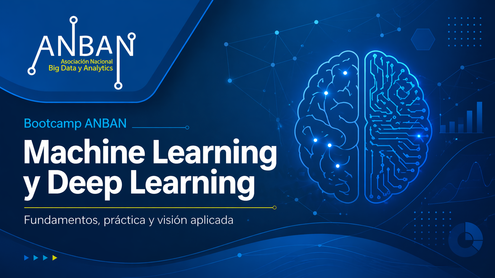

# Bootcamp ANBAN — Sesión de Machine Learning y Deep Learning

## Descripción general

Este bloque formativo del **Bootcamp ANBAN** está diseñado como una introducción sólida, progresiva y eminentemente práctica a los fundamentos de **Machine Learning (ML)** y **Deep Learning (DL)** dentro del contexto de la Ciencia de Datos.

La idea general del módulo es doble:

1. **Entender qué problemas resuelve el aprendizaje automático, cómo se plantea un flujo de trabajo correcto y cómo se evalúan los modelos con criterio.**
2. **Introducir las redes neuronales no como una caja negra, sino como una extensión natural de lo aprendido en ML clásico**, entendiendo su estructura, su proceso de aprendizaje y su implementación práctica.

El enfoque del módulo será **teórico-práctico**. Esto significa que no nos limitaremos a ejecutar código, sino que dedicaremos tiempo a comprender:

- qué significa entrenar un modelo,
- qué diferencia hay entre aprender y memorizar,
- por qué ciertas métricas son más adecuadas que otras,
- cómo organizar correctamente los experimentos,
- y cómo implementar todo esto de forma limpia usando `scikit-learn` y, en la parte de Deep Learning, herramientas de alto nivel como Keras.

---

## Estructura general del módulo

El módulo se organiza en **4 sesiones**, y cada sesión se divide en **2 bloques temáticos**, dando lugar a un total de **8 bloques**.

La distribución general será la siguiente:

- **Sesión 1 y Sesión 2**: cierre completo de **Machine Learning clásico**.
- **Sesión 3 y Sesión 4**: introducción progresiva a **Deep Learning**.

Esto nos permite separar muy bien ambos mundos:

- primero asentamos el uso de modelos clásicos, el flujo de trabajo, la validación, las métricas y las buenas prácticas;
- después pasamos a redes neuronales, su funcionamiento interno, su aprendizaje y su aplicación práctica.

---

# Sesión 1 — Fundamentos de Machine Learning + Regresión

## Bloque 1. Introducción al Machine Learning y flujo de trabajo completo

En este primer bloque construiremos la base conceptual de todo el módulo. El objetivo es que el alumnado entienda qué es realmente el Machine Learning, qué tipos de problemas aborda y cómo se estructura un flujo de trabajo de principio a fin.

### Qué veremos

- Qué es Machine Learning y qué no es.
- Tipos de problemas en ML:
  - regresión,
  - clasificación,
  - clustering,
  - reducción de dimensionalidad.
- Flujo de trabajo general de un proyecto de ML:
  - comprensión del problema,
  - exploración del dato,
  - preparación básica,
  - separación entre variables predictoras y variable objetivo,
  - entrenamiento,
  - evaluación,
  - iteración y mejora.
- Conceptos esenciales:
  - generalización,
  - overfitting,
  - underfitting,
  - sesgo y varianza.
- Introducción a la API mental de `scikit-learn`:
  - `fit`,
  - `predict`,
  - `transform`,
  - `predict_proba`.
- Diferencia entre **transformadores** y **predictores**.
- Módulos y piezas típicas de `scikit-learn`.

### Intención pedagógica

Este bloque tiene un papel muy importante: evitar que el alumnado perciba el ML como una colección desordenada de algoritmos. Antes de entrenar modelos, deben entender que existe una lógica general, una estructura de trabajo y unas buenas prácticas que se mantendrán a lo largo de todo el curso.

### Organización del bloque

Este bloque se trabajará con una mezcla de explicación conceptual, pequeños ejemplos guiados y una primera toma de contacto con `scikit-learn`, prestando mucha atención a la forma en la que esta librería organiza el trabajo en torno a objetos, métodos y pipelines mentales reutilizables.

---

## Bloque 2. Regresión supervisada

Una vez asentado el flujo general, nos centraremos en el primer gran tipo de problema supervisado: la **regresión**, es decir, aquellos casos en los que queremos predecir una cantidad numérica continua.

### Qué veremos

- Qué es un problema de regresión.
- Diferencia entre variable objetivo continua y categórica.
- Regresión lineal como primer modelo base.
- Interpretación básica de coeficientes.
- Métricas de evaluación para regresión:
  - $MAE$,
  - $MSE$,
  - $RMSE$,
  - $R^2$.
- Comparación entre distintos modelos de regresión, por ejemplo:
  - regresión lineal,
  - regresión polinómica,
  - KNN Regressor,
  - SVR,
  - árboles de decisión,
  - Random Forest Regressor.
- Papel del escalado y del preprocesado según el tipo de modelo.
- Primer contacto con:
  - `train_test_split`,
  - validación básica,
  - análisis de predicciones y errores.

### Intención pedagógica

El objetivo no es solo que sepan ajustar una recta, sino que entiendan que diferentes modelos representan diferentes hipótesis sobre la relación entre variables. También empezaremos a trabajar algo clave en todo el módulo: **cómo evaluar correctamente un modelo y cómo interpretar sus resultados**.

### Organización del bloque

Este bloque combinará explicación teórica con una práctica guiada sobre un dataset público y asequible, de manera que el alumnado pueda ver con claridad qué predice el modelo, cómo falla y qué significa realmente “mejorar” un resultado.

---

# Sesión 2 — Clasificación + evaluación rigurosa de modelos

## Bloque 3. Clasificación supervisada

En este bloque pasaremos del caso de salida continua al caso de salida discreta. Trabajaremos con problemas en los que el objetivo es asignar una observación a una clase o categoría.

### Qué veremos

- Qué es un problema de clasificación.
- Clasificación binaria y multiclase.
- Diferencia entre predecir una clase y estimar una probabilidad.
- Fronteras de decisión.
- Modelos clásicos de clasificación, por ejemplo:
  - Logistic Regression,
  - KNN Classifier,
  - SVC,
  - Decision Tree Classifier,
  - Random Forest Classifier.
- Preprocesado contextualizado:
  - cuándo conviene escalar,
  - por qué algunos modelos lo necesitan más que otros.
- Introducción a métricas de clasificación.
- Lectura básica de resultados de clasificación.

### Intención pedagógica

Queremos que el alumnado entienda que la clasificación no es simplemente “la versión discreta de la regresión”, sino un problema con una lógica propia, con métricas específicas y con un fuerte componente probabilístico e interpretativo.

### Organización del bloque

La idea será trabajar con un dataset manejable y muy didáctico, con ejemplos visuales y comparaciones entre modelos, para poder discutir no solo qué modelo acierta más, sino también **cómo y por qué toma sus decisiones**.

---

## Bloque 4. Evaluación, validación e hiperparámetros

Este bloque cierra la parte de Machine Learning clásico y es, en muchos sentidos, uno de los más importantes del módulo. Aquí consolidaremos la idea de que en ML no basta con entrenar: hay que **evaluar bien, validar bien y comparar modelos con rigor**.

### Qué veremos

- Diferencia entre entrenamiento, validación y test.
- `train_test_split` y validación cruzada.
- `cross_val_score` y `cross_validate`.
- Métricas de clasificación:
  - accuracy,
  - precision,
  - recall,
  - F1-score,
  - matriz de confusión,
  - ROC-AUC (según tiempo y nivel del grupo).
- Desbalanceo de clases y sus implicaciones.
- Parámetros frente a hiperparámetros.
- Búsqueda de hiperparámetros con `GridSearchCV`.
- Selección de modelos y comparación justa.
- Riesgo de **data leakage**.
- Buenas prácticas experimentales.

### Intención pedagógica

Este bloque busca desarrollar criterio. El objetivo es que el alumnado aprenda a desconfiar de las conclusiones rápidas y a organizar experimentos de forma seria y reproducible. Queremos que entiendan por qué un resultado aparentemente “muy bueno” puede ser engañoso si la validación está mal planteada.

### Organización del bloque

Se trabajará mediante comparación de varios modelos sobre el mismo problema, empleando diferentes métricas y técnicas de validación. El foco estará puesto tanto en la interpretación como en la implementación correcta con `scikit-learn`.

---

# Sesión 3 — Fundamentos de Deep Learning + aprendizaje

## Bloque 5. Fundamentos de Deep Learning

A partir de este punto dejamos cerrada la parte de ML clásico y entramos en el universo del Deep Learning. En este primer bloque nos centraremos en entender qué es una red neuronal, de dónde surge y cuáles son sus componentes fundamentales.

### Qué veremos

- Qué es Deep Learning y por qué aparece.
- Diferencias generales entre ML clásico y DL.
- Inspiración general de la neurona artificial.
- Componentes de una neurona:
  - entradas,
  - pesos,
  - sesgo,
  - activación.
- El perceptrón.
- Capas de entrada, ocultas y de salida.
- Redes feedforward.
- MLP (Multilayer Perceptron).
- Funciones de activación más comunes:
  - sigmoid,
  - tanh,
  - ReLU,
  - softmax.
- Redes para regresión y para clasificación.

### Intención pedagógica

La meta aquí es que el alumnado deje de ver las redes neuronales como algo misterioso. Antes de aprender a entrenarlas, primero deben comprender qué estructura tienen y cómo se construyen a partir de piezas relativamente simples.

### Organización del bloque

Trabajaremos con esquemas conceptuales, visualizaciones y ejemplos pequeños para construir una intuición clara sobre la arquitectura de una red neuronal densa.

---

## Bloque 6. Aprendizaje en Deep Learning

Una vez entendida la estructura de una red, en este bloque abordaremos la gran pregunta: **¿cómo aprende una red neuronal?**

### Qué veremos

- Qué significa “aprender” en una red.
- Función de pérdida.
- Idea de optimización.
- Descenso de gradiente.
- Learning rate.
- Épocas, batches y mini-batches.
- Retropropagación (backpropagation) a nivel intuitivo.
- Actualización de pesos.
- Optimizadores habituales:
  - SGD,
  - Adam.
- Problemas típicos del entrenamiento:
  - convergencia lenta,
  - oscilaciones,
  - exploding gradients,
  - vanishing gradients,
  - sobreajuste.

### Intención pedagógica

Queremos que el alumnado comprenda el proceso de aprendizaje en DL no como un ritual de librería, sino como un procedimiento de optimización guiado por una pérdida y mediado por derivadas, actualizaciones y decisiones de diseño.

### Organización del bloque

Se combinarán explicaciones conceptuales, ejemplos visuales del descenso de gradiente y pequeños experimentos que ayuden a interpretar cómo evoluciona el error a lo largo del entrenamiento.

---

# Sesión 4 — Implementación práctica + redes avanzadas y CNN

## Bloque 7. Implementación práctica de redes neuronales

En este bloque aterrizaremos todo lo anterior en código. El objetivo es pasar de la intuición conceptual a la construcción y entrenamiento de una red neuronal sencilla aplicada a un problema real.

### Qué veremos

- Implementación práctica de una MLP.
- Definición de arquitectura.
- Capas densas.
- Función de pérdida según el tipo de problema.
- Optimizador.
- Proceso de entrenamiento.
- Predicción y evaluación.
- Curvas de entrenamiento y validación.
- Regularización básica:
  - dropout,
  - early stopping,
  - regularización L2.
- Normalización y estabilidad del entrenamiento.

### Intención pedagógica

La idea es que el alumnado sea capaz de construir una red pequeña de principio a fin, entendiendo lo que está definiendo en cada paso y sabiendo interpretar si la red está aprendiendo bien o si está sobreajustando.

### Organización del bloque

Este bloque se planteará de forma muy práctica, probablemente con Keras, buscando una implementación clara, legible y alineada con todo lo discutido en la sesión anterior.

---

## Bloque 8. Redes avanzadas y CNN

El último bloque servirá como cierre del módulo y como apertura hacia arquitecturas más potentes y especializadas. Partiremos de las limitaciones de las redes densas tradicionales para introducir el papel de las redes convolucionales.

### Qué veremos

- Limitaciones de los MLP en ciertos tipos de datos.
- Idea de representación jerárquica.
- Introducción a las CNN:
  - convolución,
  - filtros,
  - mapas de activación,
  - pooling.
- Por qué las CNN son especialmente útiles en visión por computador.
- Relación entre estructura del dato y arquitectura adecuada.
- Panorama general de arquitecturas más avanzadas.
- Cuándo tiene sentido usar ML clásico y cuándo tiene sentido usar DL.
- Cierre comparativo entre ambos enfoques.

### Intención pedagógica

No se trata de entrar en profundidad en todas las arquitecturas modernas, sino de dejar al alumnado con una visión clara de que las redes densas son solo el punto de partida, y de que las CNN son una herramienta esencial cuando trabajamos con imágenes y datos con estructura espacial.

### Organización del bloque

Trabajaremos con una introducción conceptual acompañada, si el tiempo lo permite, de una pequeña demostración práctica para visualizar cómo una CNN procesa imágenes de forma muy distinta a una red densa convencional.

---

# Cómo vamos a organizar las sesiones

El módulo seguirá una metodología de trabajo orientada a la comprensión progresiva y a la participación activa. En general, cada bloque combinará:

1. **Explicación conceptual** para introducir los fundamentos teóricos.
2. **Ejemplos guiados** para aterrizar ideas abstractas.
3. **Notebook práctico** para implementar paso a paso los conceptos.
4. **Análisis e interpretación de resultados** para desarrollar criterio.
5. **Discusión y recapitulación** para consolidar el aprendizaje.

La intención no es que el alumnado memorice sintaxis, sino que aprenda a:

- reconocer el tipo de problema que tiene delante,
- elegir un enfoque razonable,
- organizar correctamente los datos,
- entrenar con criterio,
- evaluar sin engañarse,
- y entender qué está ocurriendo realmente cuando un modelo aprende.

---

# Herramientas principales

A lo largo del módulo trabajaremos principalmente con:

- **Python**
- **NumPy**
- **pandas**
- **Matplotlib** y/o **Seaborn** para visualización
- **scikit-learn** para la parte de Machine Learning clásico
- **Keras** (y eventualmente TensorFlow) para la parte de Deep Learning

La idea es apoyarnos en librerías estándar del ecosistema para que el alumnado aprenda herramientas que le seguirán siendo útiles más allá de este módulo.

---

# Filosofía del módulo

Este módulo está planteado con una filosofía muy clara:

- **entender antes de automatizar**,
- **comparar antes de concluir**,
- **evaluar antes de celebrar**,
- y **usar el código como una herramienta para pensar, no solo para ejecutar**.

Queremos que el alumnado salga con una visión ordenada del campo, con una base sólida para seguir profundizando y con una primera experiencia realista de cómo se trabaja con modelos de Machine Learning y Deep Learning en contextos aplicados.

---

## Resumen rápido de las 4 sesiones

### Sesión 1
- Bloque 1: Introducción al ML y flujo de trabajo completo
- Bloque 2: Regresión supervisada

### Sesión 2
- Bloque 3: Clasificación supervisada
- Bloque 4: Evaluación, validación e hiperparámetros

### Sesión 3
- Bloque 5: Fundamentos de Deep Learning
- Bloque 6: Aprendizaje en Deep Learning

### Sesión 4
- Bloque 7: Implementación práctica de redes neuronales
- Bloque 8: Redes avanzadas y CNN

